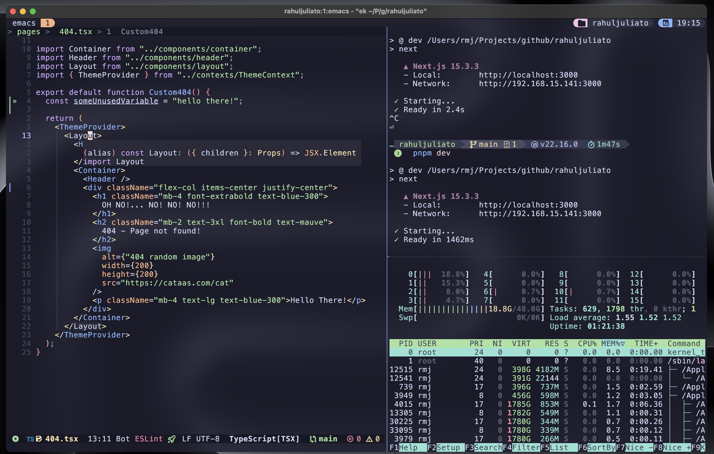

# Emacs-Kick(starter) for Vim/Neovim Users

Welcome to `Emacs-Kick`, a feature-rich Emacs configuration designed
for users familiar with `Vim`, `Neovim`, and `Vi`. With this
setup, you don't need to leave behind your favorite terminal or tools
like `yazi`, `starship`, `lazygit`, and `lazydocker` just to
give Emacs a try.


Use Emacs the same way you'd use `Neovim`, seamlessly integrating it
into your workflow inside terminal multiplexers like `tmux` or
`Zellij`, while also enjoying modern features such as `treesitter`
and `LSP`—no hassle.




**Emacs-Kick** isn’t a full-fledged distribution but rather a
**starting point** for building your own Emacs configuration. It’s
designed to be especially accessible for Vim/Neovim users, letting you
explore the power of Emacs without committing to its entire ecosystem.


You can take advantage of Emacs’ features without needing to master
every Emacs-specific workflow right away. And if you find yourself
enjoying it, you can:

- Run it in a GUI for a richer experience
- Customize and expand your configuration as much as you want
- Experiment with frameworks like Doom Emacs or Spacemacs
- Tinker with vanilla Emacs to build a setup entirely your own
OR...
- Just keep using it on TUI, it is all up to you!


With Emacs-Kick, the goal is to empower you to explore Emacs at your
own pace. The sky's the limit! 🌟


## Minimum Requirements

- Emacs version **>=30**
  - You can verify your version by running:

```bash
emacs --version
```

## Installation Instructions

1. **Clone the repository**:

**Note**: If you already have an existing Emacs configuration in
`~/.emacs.d`, please back it up before proceeding. You can do this
by renaming the directory:


```bash
mv ~/.emacs.d ~/.emacs.d.backup
```

If you have any additional configurations from other Emacs
installations, please clean them up. This includes directories and
files such as `~/.emacs.d`, `~/.emacs`, `~/.emacs~`,
`~/.config/emacs`, `~/.config/doom`, `~/.config/cache/emacs` and
any other related files.


After deleting/backing up, clone the repository:

```bash
git clone https://github.com/LionyxML/emacs-kick.git ~/.emacs.d
```

2. **Run the setup**:

   After cloning, install the configuration by running:

```bash
emacs -nw --eval="(ek/first-install)"
```

Alternatively, you can run the provided script `ek-reinstall.sh`
from inside `~/.emacs.d/`, which will achieve the same result:

```bash
cd ~/.emacs.d/ && ./ek-reinstall.sh
```

Both methods will install all necessary packages and apply the
configuration.


**NOTE**: You will be prompted to install Tree-sitter grammars and
download some fonts (this configuration uses Nerd Fonts by
default). While you can choose to do this later, it is highly
recommended to complete these steps during the installation process
for the best experience!


3. **Set terminal mode by default**:

**Note on Emacs TUI/GUI**: Emacs automatically adapts to either
graphical or terminal mode depending on the environment. But if
you're in a graphical session and prefer terminal mode, just use:

```bash
emacs -nw
```

To ensure Emacs always opens in terminal mode, add the following to
your `.bashrc` or `.zshrc`:

```bash
alias emacs='emacs -nw'
```

Then, reload your shell configuration with:

```bash
source ~/.bashrc  # for bash
source ~/.zshrc   # for zsh
```

4. **Start Emacs**:

Once set up, start Emacs with:

```bash
emacs
```

**Usage Tips**:
- **Leader Key**: The leader key is set to `SPC` (spacebar),
  `which-key` is there to help you discover keybindings.
- **Help Commands**:
  - `SPC h i` opens the Emacs info documentation (`M-x info`).
  - `SPC h v` allows you to explore available variables.
  - `SPC h f` lets you explore functions.
  - `SPC h k` displays keybindings.

**Troubleshooting**:
- If you encounter any issues during installation, check the
  `*Messages*` buffer for more information. You can switch between
  buffers with `SPC SPC`, and navigate options using `C-p` and `C-n`.


## Available Commands

| Keybinding          | Action                                    |
|---------------------|-------------------------------------------|
| `SPC`               | Leader key                                |
| `C-d`               | Scroll down                               |
| `C-u`               | Scroll up                                 |
| `<leader> s f`      | Find file                                 |
| `<leader> s g`      | Grep                                      |
| `<leader> s G`      | Git grep                                  |
| `<leader> s r`      | Ripgrep                                   |
| `<leader> s h`      | Consult info                              |
| `<leader> /`        | Consult line                              |
| `<leader> x x`      | Consult Flymake                           |
| `] d`               | Next Flymake error                        |
| `[ d`               | Previous Flymake error                    |
| `<leader> x d`      | Dired                                     |
| `<leader> x j`      | Dired jump                                |
| `<leader> x f`      | Find file                                 |
| `] c`               | Next diff hunk                            |
| `[ c`               | Previous diff hunk                        |
| `<leader> e e`      | Toggle NeoTree                            |
| `<leader> g g`      | Open Magit status                         |
| `<leader> g l`      | Show current log                          |
| `<leader> g d`      | Show diff for current file                |
| `<leader> g D`      | Show diff for hunk                        |
| `<leader> g b`      | Annotate buffer with version control info |
| `] b`               | Switch to next buffer                     |
| `[ b`               | Switch to previous buffer                 |
| `<leader> b i`      | Consult buffer list                       |
| `<leader> b b`      | Open Ibuffer                              |
| `<leader> b d`      | Kill current buffer                       |
| `<leader> b k`      | Kill current buffer                       |
| `<leader> b x`      | Kill current buffer                       |
| `<leader> b s`      | Save buffer                               |
| `<leader> b l`      | Consult buffer                            |
| `<leader>SPC`       | Consult buffer                            |
| `<leader> p b`      | Consult project buffer                    |
| `<leader> p p`      | Switch project                            |
| `<leader> p f`      | Find file in project                      |
| `<leader> p g`      | Find regexp in project                    |
| `<leader> p k`      | Kill project buffers                      |
| `<leader> p D`      | Dired for project                         |
| `P`                 | Yank from kill ring                       |
| `<leader> P`        | Yank from kill ring                       |
| `<leader> .`        | Embark act                                |
| `<leader> u`        | Undo tree visualize                       |
| `<leader> h m`      | Describe current mode                     |
| `<leader> h f`      | Describe function                         |
| `<leader> h v`      | Describe variable                         |
| `<leader> h k`      | Describe key                              |
| `] t`               | Go to next tab                            |
| `[ t`               | Go to previous tab                        |
| `<leader> m p`      | Format with Prettier                      |
| `<leader> c a`      | Execute code action                       |
| `<leader> r n`      | Rename symbol                             |
| `gI`                | Find implementation                       |
| `<leader> l f`      | Format buffer via LSP                     |
| `K`                 | Show hover documentation                  |
| `gcc`               | Comment/uncomment current line            |
| `gc`                | Comment/uncomment selected region         |

...and a lot more, discoverable with which-key :)


## Contributing

This package is intentionally designed with a specific vision in mind,
reflecting my own opinions and preferences. While contributions are
welcome, please understand that this configuration is quite
opinionated.


If you have suggestions or requests, they will be considered
carefully, but I cannot make any promises regarding implementation or
acceptance. Your input is valuable, and I appreciate any help or
feedback to improve the project.


To contribute, feel free to open an issue or submit a pull
request. Let's make this configuration even better together!
